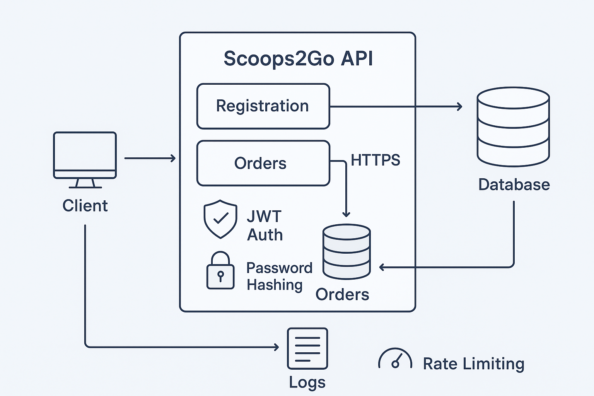

# Threat Model – Scoops2Go API

## System Overview
The Scoops2Go API is a RESTful service for user registration, login, and order management.
It allows customers to register, authenticate, and place orders while ensuring confidentiality, integrity, and availability of all data.

**Data Flow Diagram:**

---

## STRIDE Analysis

| Threat                  | Description                                      | Mitigation                                             |
|--------------------------|--------------------------------------------------|----------------------------------------------------------|
| **Spoofing**               | Attacker logs in as another user (identity theft)      | JWT tokens, strong password hashing, MFA (optional) |
| **Tampering**               | Altering API requests or database records               | HTTPS, input validation, DB permissions, integrity checks |
| **Repudiation**              | Users deny placing orders or performing actions         | Logging, timestamps, signed tokens, audit trails |
| **Information Disclosure**   | Leak of sensitive user data (names, addresses, orders)  | HTTPS, auth checks, encrypted storage, least privilege |
| **Denial of Service**        | Flooding API with excessive requests                     | Rate limiting, request throttling, monitoring alerts |
| **Elevation of Privilege**   | Gaining admin rights from normal user account            | Role-based access control, principle of least privilege, secure session handling |

---

## Known Vulnerabilities
- Hardcoded secrets must be removed from codebase
- Dependencies must be checked for known CVEs before deployment
- Debug mode must be disabled in production builds
- Access control must be enforced consistently on all endpoints

---

## Security Controls Summary
- **Authentication:** JWT Bearer tokens with expiry
- **Password Protection:** bcrypt hashing with salt
- **Transport Security:** Enforce HTTPS (TLS 1.2+)
- **Secrets Handling:** Environment variables / GitHub Secrets
- **CI Pipeline:** Automated build, tests, dependency vulnerability scan
- **Monitoring:** Logging, audit trails, and health checks

